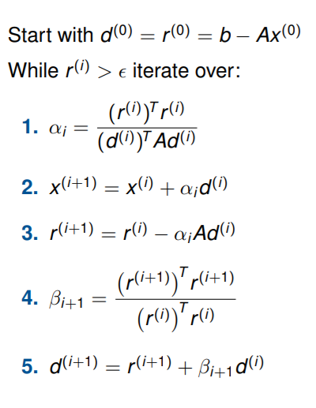

# CFD Lab - Final Project (Group H)
- Boris Martin 
- Kanishk Bhatia 
- Rahul Manavalan
## Iterative Krylov solvers and Preconditioners  

### Motivation 

The "vanilla" fluidchen solver uses SOR (a variant of Gauss-Seidel algorithm) for solving the Pressure Poisson Equation. While the SOR is respectable in its own right, it does not scale well if the domain is refined. Theoretical explanations involve frequency analysis (SOR dampens some frequences more than the others), which leads to the family of Multigrid methods, that we didn't study here.

In this project, we seek faster means to solve the PPE, as this would go a long way in exploring finer mesh sizes for the problems that we may setup using our fluidchen solver. Due to the sparsity of the matrix for the given problem (Poisson Equation, with up to 5 non-zeros elements per line), we stick to iterative solvers. Furthermore, the matrix is (for the right formulation) symmetric and (sometimes semi) positive definite. For these matrices, solving Ax = can be reformulated as the minization of a quadratic function. The most popular method in this case is the Conjugate Gradients algorithm. We can prove that it gives the exact solution in N steps, with N the dimension of the problem. In practice, stopping much earlier gives a very good approximation, with a residual that can be below our tolerance requirements.

In addition to exploring the traditional CG, we also implemented the Jacobi iterative solver, the Steepest Descent algorithm and some preconditioners applied to CG, to reduce the number of iterations that might be needed for the desired tolerance. We parallelized those that could be, but some preconditioners are fundamentally not parallel.

### Additions to "vanilla" fluidchen 

- CG solver - Conjugate Gradient 
- SD solver - Steepest Descent 
- Jacobi Preconditioned CG 
- Symmetric Gauss Seidel preconditioned CG 
- IDLU preconditioned CG 

All of the implementations except GS preconditioner and IDLU are compatible with the parallelization model introduced in Worksheet 3. 

### CG algorithm

Source : Scientific Computing II, slides from Univ.-Prof. Dr. Michael Bader.

### Implementation Details 

We foucs on a matrix free implementation, (this was one of the most tedious part of the implementations), as we wanted the solver to have as little overhead as possible. The matix free implementation has the following features 

- It never assembles the A matrix 
- It does not flatten the b vector - i.e. rhs_matrix is taken as is and worked upon. (Question of parallelization on a GPU? : Yes, SIMD parallelization on a GPU sadly requires refactoring our code.) 

The implementation exploits the runtime polymorphism that is furnished by the PressureSolver interface used earlier. Each solver is a subclass of PressureSolver.
Unlike SOR, most solvers need an initialization step. This was added to the interface (with a default, "do-nothing" implementation) and is called accordingly in the main loop

A typical preconditioned solver in our implementation is realized using two functions: 
A high level algorithmic breakdown is as described: 
- CG_x Init : 
            1. r_0 = b - Ap
            2. r_cap_0 = M.inv * r_0
            3. sigma = r_0 dot (M.inv * r_0) = r_0 dot r_cap_0
            4. d_0 = r_cap_0

- CG_x Solve :
            Note: Terminology --> direction <=> M.inv*r <=> "q" <=> "cond_residual"
            1. Compute alpha = r.q / q.Aq = sigma / q.Aq
            2. Update p(ij) = p_old(ij) + alpha*q(ij)
            3. Update r(ij) = r_old(ij) - alpha*A.q(ij)
            4. Condition the residual ( Solve P*q = r )
            5. Compute new directions ( d(ij) = r_cap(ij) + beta * d_old(ij) )

It should be mentioned that in the parallel versions of the code, synchronization is performed as required. 

One question to ask is , how would we differentiate the CG(special case) and the p-CG versions? 
- CG is a special case of p-CG where M = I
- So the purpose of cond_residual becomes moot, hence is removed from the CG Implementation 

### Building 

Building the code for the project should be no different than the one for the "vanilla" fluidchen solver. Nonetheless for the sake of completion we mention the recommended way :
        
        mkdir build 
        cd build 
        cmake .. 
        make 

Building inside the main folder is possible too, though less elegant.

A few build options are available, in case of troubleshooting.

- Defining NO_FILESYSTEM can help if your compiler doesn't support C++17 filesystem support. We needed it to run on a LRZ cluster. If this is defin
- Defining DEF_COMPARE_TRUE_RES compares the residual computed by the solver and the actual residual. This can be used to check correctness of a solver.

This can be done on command line `make CXX_FLAGS=-DNO_FILESYSTEM` for instance.

### Interface 

The solver can be chosen by simply specifying the solver on the config file using the **pressure_solver** keyword. The options that the user has at disposal are : 

- CG 
- SD
- Jacobi
- CG_Jacobi 
- CG_GS (Serial only)
- CG_IDLU (Serial only) (Broken - Debugging : Shall be committed latest on 12/07/2021 by 23:00 )

        pressure_solver {solver_param}
        # Example : 
        pressure_solver CG_GS

Default value is SOR. Furthermore, the parameter "omg" from the previous worksheet is still used in SOR, and can also be used in the Jacobi solver ("Dampened Jacobi"). Note that stable values with Jacobi are in range [0,1] and not [0,2] like SOR.

### Execution 

The first few solvers offer themselves to parallelization, but the preconditioned GS and IDLU are outliers and can only be run serially. 

Serial (Withing build) 
    
    ./fluidchen ../example_cases/Parallel_Cases/1_4/LidDrivenCavity.dat
    
Parallel with X processes (Within build)

    mpirun -np X ./fluidchen ../example_cases/Parallel_Cases/1_4/LidDrivenCavity.dat

The .dat file must give iproc and jproc such that iproc * jproc = X.

### Why is CG better ? (Disclaimer : Involves theory) 

As mentioned, the SOR solver is a stationary iterative method and the rate of convergence is quite long. This is particularly true for fine refinements as we had seen in the instances in WS-3. 

CG is based on a different philosophy, wherein in order to solve the LSE, we minimize a quadratic function whose derivative is Ax-b.

The miracle in CG is that, this offers a best approximation among all solutions that are possible in the explored vector subspace. This subspace, called the Krylov subspace, consists in the span of vectors b, Ab, A²b, ... A^(k-1)b at the iteration k. This is one of the reasons why the residuals in the CG are orthogonal with previous search directions.

Long story short, CG overcomes the convergence rate of the traditional SOR and in turn allows us to explore physics in a finer resolution on your personal computer. 

It is important to mention that the convergence rate of CG is a direct function of the condition number of the Poisson Matrix. Hence if a given config of the PM, has a high condition number, CG suffers from a similar bottleneck as compared to the SOR, so the natural extension to our project also involved preconditioners, which in essence should attenuate this problem. 

This is not to say that our solver can deal with any problem. Obviouly there are several preconditioners around that are fine-tuned for many applications. These implementations here are the most basic ones that are suited for a Symmetric Positive Definite Matrix such as the Poisson Matrix. 

### Existence and uniqueness of the solution of the PPE : a tale of epic debugging.

While debugging a leftover issue from WS3, we stumbled upon a few interesting properties of the PPE in case of homogenous Von Neumann boundary conditions on the entire boundary. One that was obvious is that the solution was not unique : adding a constant term to a valid solution gives another one.
A less trivial thing is that the existence is only guaranteed if a condition is met : for the continous problem, the integral of the right hand side of the equation must be zero, otherwise the problem is unsolvable. Indeed, when integrating the equation "laplacian(P) = f" over the domain, we see that the integral of f must equals the integrale of the laplacian, which, by Gauss theorem, is the flux of the pressure gradient. This flux is null by the BCs, which implies that f must be null on average.
In the discrete case, at least on a mesh with constant size and dx = dy, this condition becomes that the sum of all the elements of the right hand side vector sum to zero.
Our bug led to an unbalance in the right hand side (because of errors in the time step synchronization), thus to an unsolvable system. We spent a long time trying to fix correct solvers because of this !

### Known issues

For some reasons, despite giving perfectly correct results within tolerance, some simulations blow up when CG is used in parallel. No obvious explanation was found, as the non-PPE code looks correct (no issues with SOR), and the solver itslef seems flawless.
To reproduce : LidDrivenCavity on a 70x70 mesh, viscosity of 0.01, iproc = jproc = 2, conjugate gradients with tolerance 0.001, adaptive timestepping. Instability should come at the 700th timestep (t = 2.25781).
